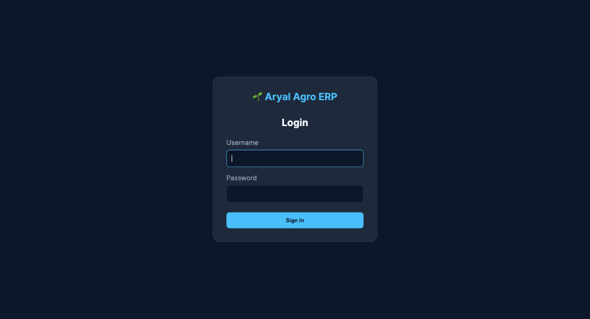
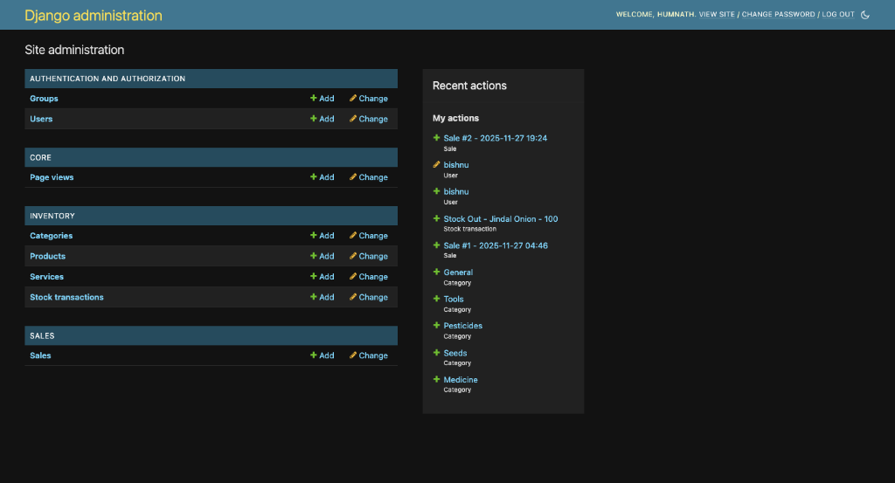
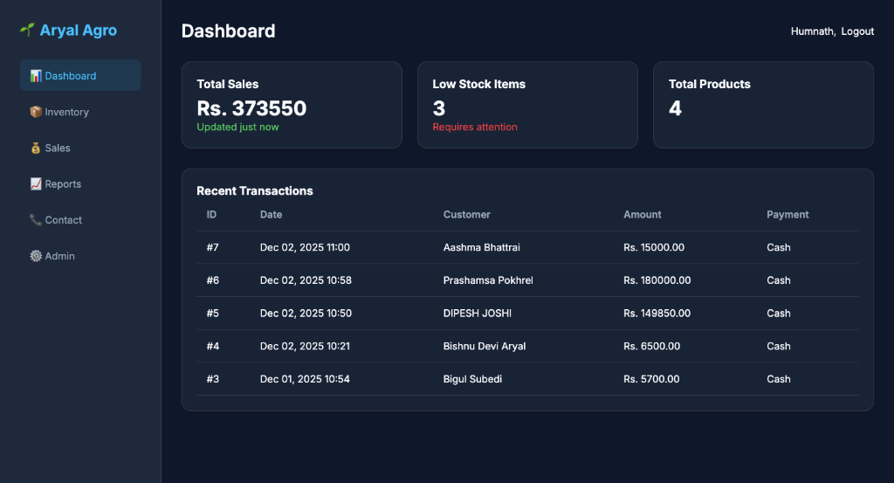
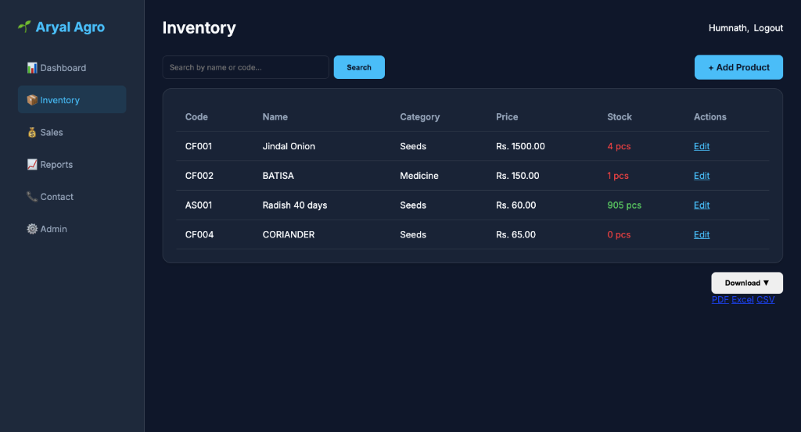
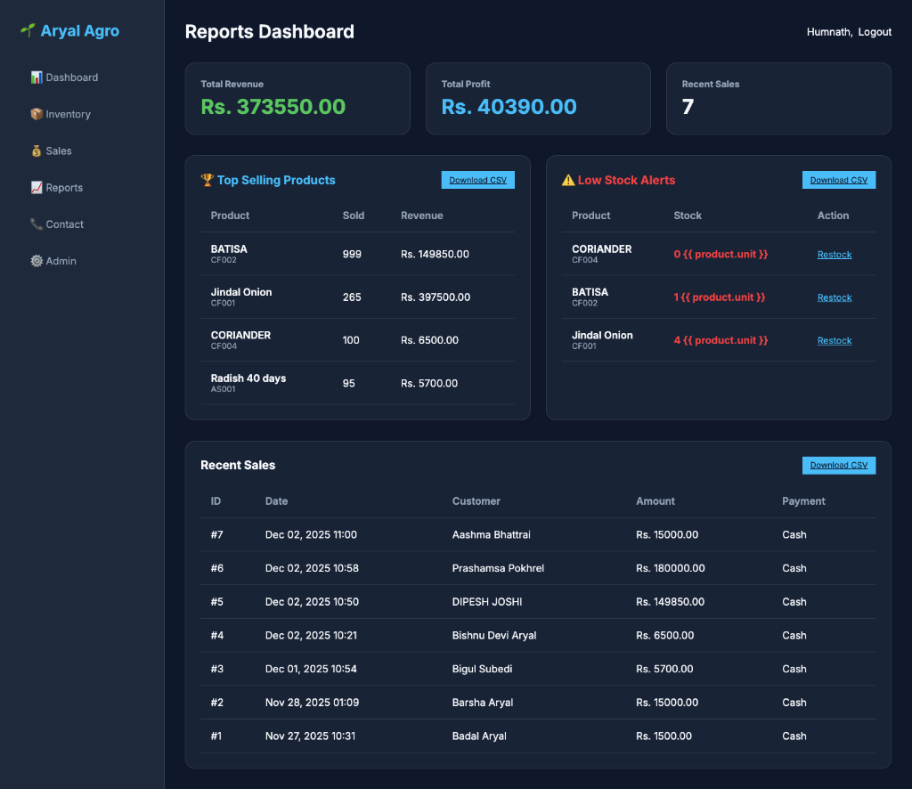

# Aryal Agro ERP 🌱

A comprehensive Enterprise Resource Planning (ERP) system designed for Aryal Agro Enterprises to manage veterinary and agro products, sales, and inventory.

## Features 🚀

-   **Inventory Management**: Track products, categories, prices, and stock levels.
-   **Sales Management**: Process sales, generate invoices, and track revenue.
-   **Admin Dashboard**:
    -   Comprehensive admin interface for managing all data.
    -   **Page View Statistics**: Track site traffic, unique visitors, and top pages directly from the admin panel.
-   **Responsive Design**: Modern, dark-themed UI that works seamlessly on desktop and mobile devices.
-   **Contact Page**: Easy access to business contact information.


## Screenshots 📸


*Login Screen*


*Admin Dashboard*


*Dashboard*


*Inventory Management*


*Reports & Analytics*

## Tech Stack 🛠️

-   **Backend**: Django (Python)
-   **Database**: SQLite (Development) / PostgreSQL (Production)
-   **Frontend**: HTML, CSS (Custom Dark Theme), JavaScript
-   **Deployment**: PythonAnywhere
-   **Static Files**: WhiteNoise

## Installation 💻

1.  **Clone the repository**:
    ```bash
    git clone https://github.com/badalaryal11/aryal-erp.git
    cd aryal-erp
    ```

2.  **Create a virtual environment**:
    ```bash
    python3 -m venv venv
    source venv/bin/activate  # On Windows: venv\Scripts\activate
    ```

3.  **Install dependencies**:
    ```bash
    pip install -r requirements.txt
    ```

4.  **Set up environment variables**:
    Create a `.env` file in the root directory:
    ```env
    SECRET_KEY=your_secret_key
    DEBUG=True
    ALLOWED_HOSTS=127.0.0.1,localhost
    ```

5.  **Run migrations**:
    ```bash
    python manage.py migrate
    ```

6.  **Create a superuser**:
    ```bash
    python manage.py createsuperuser
    ```

7.  **Run the development server**:
    ```bash
    python manage.py runserver
    ```

## Usage 📖

-   Access the **Dashboard** at `http://127.0.0.1:8000/`.
-   Manage **Inventory** and **Sales** via the sidebar navigation.
-   Access the **Admin Panel** at `http://127.0.0.1:8000/admin/` to manage users, view stats, and configure the system.

## Deployment 🌍

This project is configured for deployment on **PythonAnywhere**.

1.  Pull the latest code.
2.  Install requirements.
3.  Run migrations.
4.  Reload the web app.

## Contact 📞

**Aryal Agro Enterprises**
-   📍 Address: Rampur Ward No.5, Palpa, Nepal
-   📞 Phone: 9851220582 / 9849891074
-   ✉️ Email: aryalagro.enterprises@gmail.com
